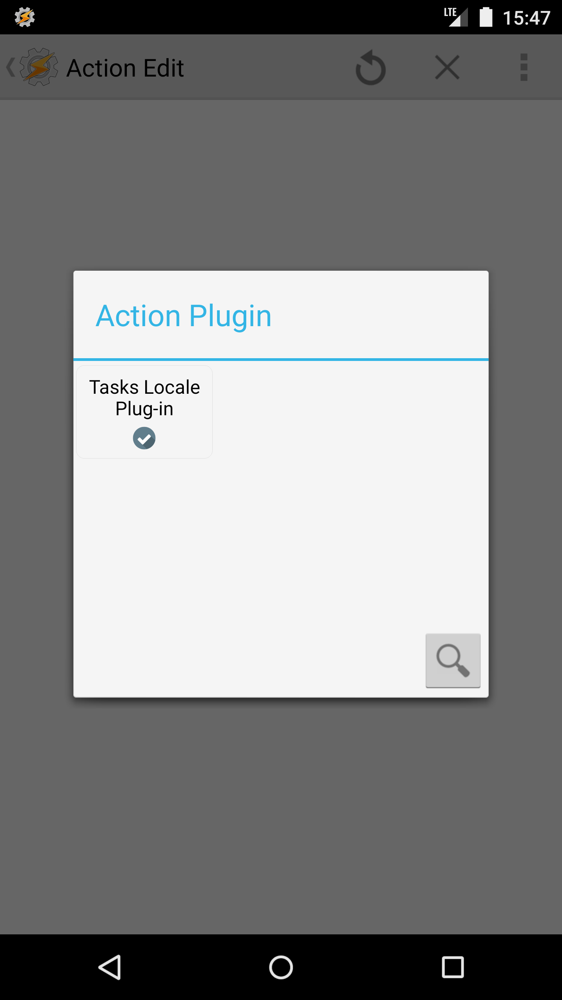

 

This Locale/Tasker plug-in adds the ability to trigger a [Tasks](https://github.com/tasks/tasks) notification for a tag, filter, or Google Task list. If there are no active tasks for the trigger then the notification will not be displayed.

### Screenshots

